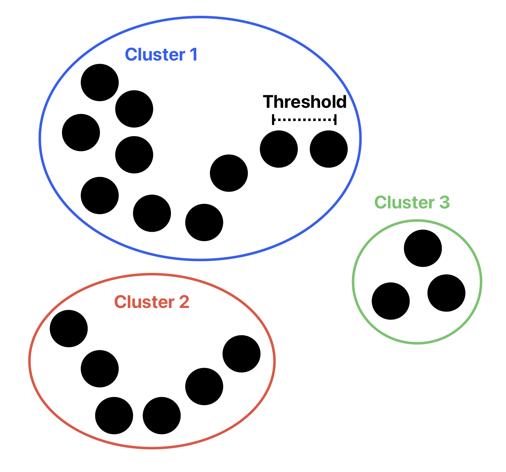

# Cluster finder 🔍
In this context, a cluster is defined as a subset of points where the distance between two neighboring points is less than a given threshold. It is though for 3D space, but might be easily tuned up (if it does not work already) for higher dimensions using euclidean distance. I suspect there might be a more efficient implementation.

**INPUT:** 
- *points*: Set of N points in 3D space. NX3 array.
- *threshold*: Maximum distance between two points to belong to the same cluster.

**OUTPUT:**
- *clusters*: MX1 cell array, with each cluster, each cluster being an array with the index of the points that make it up. M is the total number of clusters.
- *cluster_id*: An NX1 array mapping each point to the cluster index it belongs to.

## Prototype:
[clusters, cluster_id] = cluster_finder(points, threshold);
